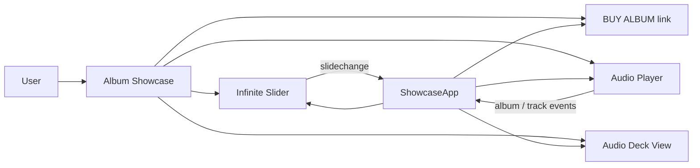
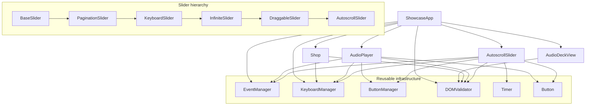
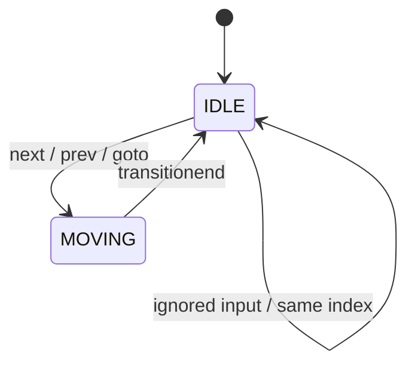
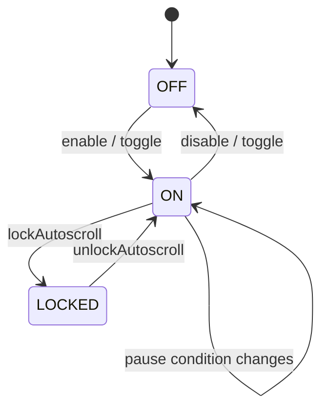
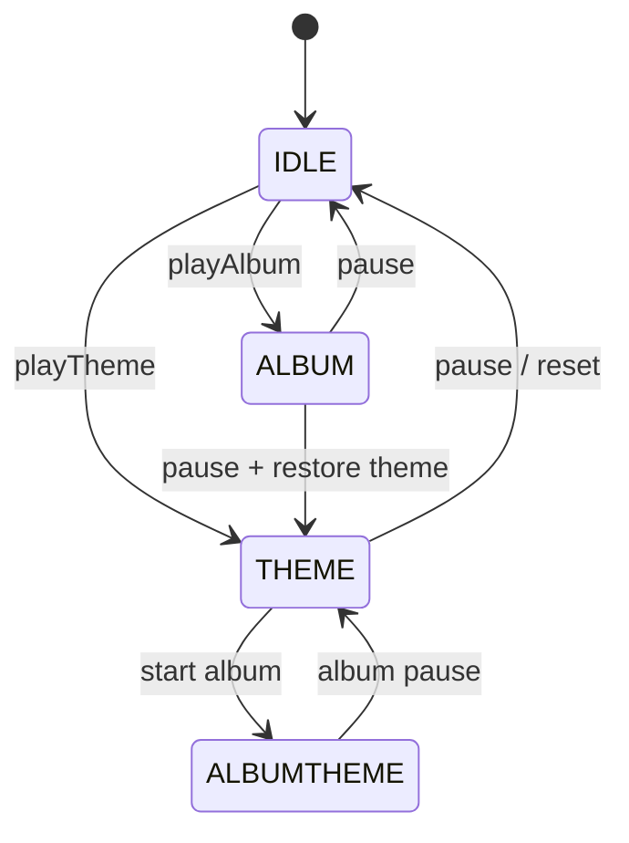
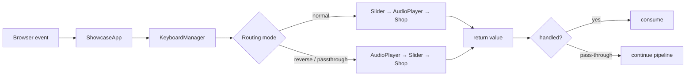
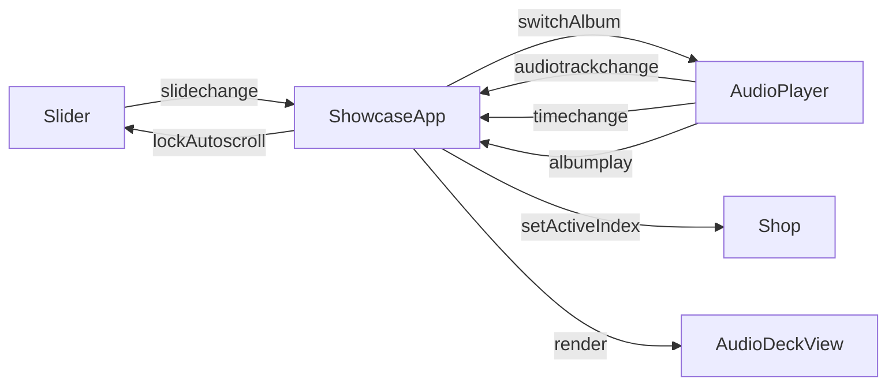

# Interactive Showcase

The application combines an **infinite album slider**, **drag/touch interaction**, **keyboard control**, **automatic scrolling**, an integrated **audio player**, synchronized **album/shop data**, and a small set of reusable infrastructure services.

> **Architecture note:** the project exists in two JavaScript implementation variants. The public architecture is intentionally the same, so this documentation describes the shared design rather than a particular JavaScript syntax.

---

## What the application does



The showcase contains five configured album entries and their playlists.
The same album index is used to keep the visual showcase, audio playlist and purchase link synchronized.

---

## Main architecture



---

## Slider capabilities are layered by inheritance

```text
BaseSlider
   │  core movement, state, index, resize
   ▼
PaginationSlider
   │  generated pagination
   ▼
KeyboardSlider
   │  keyboard routing
   ▼
InfiniteSlider
   │  clones + teleportation + logical index normalization
   ▼
DraggableSlider
   │  mouse/touch drag lifecycle
   ▼
AutoscrollSlider
      timer + pause/resume + lock + visibility/focus handling
```

Each layer adds one major capability while preserving the parent contract.

---

## Three local FSMs

### 1. Slider movement FSM



`MOVING` blocks conflicting input until the transition finishes.

### 2. Autoscroll FSM



The timer itself is not the state. It is the mechanism that advances the slider while the autoscroll state permits it.

### 3. Audio playback FSM



`ALBUMTHEME` represents the application-level transition in which album playback is requested while the main theme is the current audio context.

---

## Input pipeline

The application routes keyboard and pointer input through components instead of hard-coding every interaction in one handler.



The same idea is used for clicks through `Button` and `ButtonManager`.

---

## Event-driven coordination

Components expose domain-level DOM events such as:

```text
slidemove
slidechange
autoscrollchange
albumplay
albumpause
albumplaypassthrough
albumend
audiotrackchange
timechange
viewportclick
```

The event flow is intentionally one-directional at the application boundary:



---

## Reusable infrastructure

| Service           | Responsibility                                                                 |
| ----------------- | ------------------------------------------------------------------------------ |
| `EventManager`    | declarative event maps, prototype-chain event discovery, dynamic subscriptions |
| `KeyboardManager` | configuration → key matching → component handler dispatch                      |
| `ButtonManager`   | configuration → button matching → component handler dispatch                   |
| `DOMValidator`    | fail-fast validation of required DOM nodes and collections                     |
| `Timer`           | controlled interval lifecycle with an optional bootstrap/restart callback      |
| `Button`          | small command adapter for DOM buttons                                          |

These services keep infrastructure concerns out of the slider and audio domain logic.

---

## Key interaction flows

**Manual navigation**

```text
keyboard / click
      ↓
ShowcaseApp
      ↓
Slider.next() / prev() / goto()
      ↓
MOVING
      ↓
transitionend
      ↓
slidechange
      ↓
Shop + AudioPlayer synchronization
```

**Autoscroll**

```text
Timer tick
    ↓
AutoscrollSlider._nextAuto()
    ↓
Slider movement
    ↓
slidechange
    ↓
album synchronization
```

**Album playback**

```text
AudioPlayer.playAlbum()
       ↓
albumplay
       ↓
ShowcaseApp
   ├── lock slider autoscroll
   └── activate audio layout
```

**Drag**

```text
pointer down
    ↓
pause autoscroll
    ↓
subscribe temporary document handlers
    ↓
move track
    ↓
pointer up / cancel
    ↓
threshold decision
    ↓
next / prev / restore position
    ↓
unsubscribe temporary handlers
    ↓
resume when allowed
```

---

## Data-driven configuration

Component behaviour is configured through objects passed to constructors. The configuration contains selectors, CSS classes, command names, key maps, timing values and application data.

A representative keyboard contract is:

```js
press: {
    next: ["ArrowRight", "KeyD"],
    prev: ["ArrowLeft", "KeyA"]
}
```

`KeyboardManager` derives the expected method name (`_pressNext`, `_pressPrev`) and validates that the component actually provides it.

This gives the configuration a real runtime contract instead of treating it as passive constants.

---

## Infinite loop model

The visual slider contains two cloned boundary slides:

```text
[last clone] [1] [2] [3] ... [N] [first clone]
     ↑                         ↑
   teleport                  teleport
```

The internal index may temporarily point at a clone. `InfiniteSlider` maps those positions back to the corresponding real slide and keeps the public/logical index normalized.

---

## Accessibility and interaction details

The implementation also handles several interaction details rather than relying only on the happy path:

- pagination buttons receive `aria-label` and `aria-current`;
- focus is cleared when switching interaction modes;
- keyboard button feedback is represented by a temporary CSS state;
- autoplay can pause on hover/focus;
- document visibility affects autoplay behaviour;
- touch multi-contact is rejected for the drag operation;
- middle/right-button edge cases are explicitly handled;
- browser media shortcuts are accounted for by the audio player;
- resize temporarily suspends normal slider interaction and restores it afterward.

---

## Project structure

```text
on-.../
├── assets/
│   ├── audio/
│   └── images/
├── script/
│   ├── components/
│   ├── core/
│   ├── services/
│   ├── utils/
│   ├── main.js
│   └── showcase-app.js
├── styles/
│   ├── reset.css
│   └── main.css
├── index.html
└── README.md
```

---

## Design vocabulary

The project deliberately uses a few established ideas where they fit the implementation:

- **Prototype inheritance / polymorphism** — the slider grows by specialized prototypes and override hooks.
- **Command dispatch** — keyboard and button configuration resolve input to component commands.
- **Observer-like event publication** — components publish custom DOM events without calling application methods directly.
- **Application coordinator** — `ShowcaseApp` coordinates component interactions while domain mechanics stay inside their components.
- **Fail-fast validation** — invalid DOM/configuration contracts stop initialization rather than being hidden by silent fallbacks.

These are descriptions of the actual implementation, not an attempt to force every part into a formal GoF pattern.
