# Interactive Showcase

## 1. Scope and architectural intent

The important distinction is not the syntax used to express objects, but the underlying design:

- a layered slider capability hierarchy;
- independent component responsibilities;
- reusable infrastructure services;
- local finite-state models for separate behavioural concerns;
- configuration-driven command routing;
- declarative event maps;
- dynamic event subscriptions for temporary interaction lifecycles;
- custom DOM events for cross-component communication.

The project is intentionally more structured than the smallest possible implementation of a slider because its purpose is to explore object-oriented JavaScript architecture on a non-trivial interactive UI.

---

# 2. High-level system model

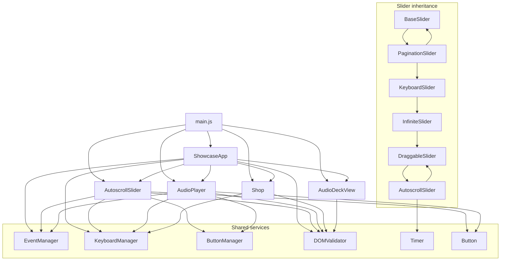

The application boundary is formed by `ShowcaseApp`. The components own their domain behaviour. Services solve recurring infrastructure problems.

---

# 3. Project composition

## 3.1 `main.js`

`main.js` is the composition root.

It creates:

```text
AutoscrollSlider
AudioPlayer
AudioDeckView
Shop
ShowcaseApp
```

and supplies each component with its configuration and data before calling `app.init()`.

Conceptually:

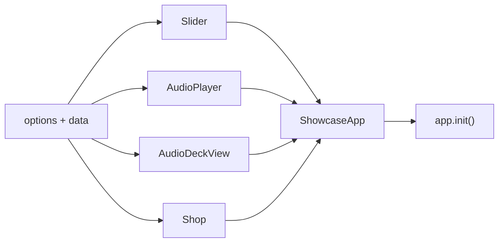

The composition root therefore contains application wiring/data rather than slider implementation details.

---

# 4. Component responsibilities

| Component          | Owns                                                                                       |
| ------------------ | ------------------------------------------------------------------------------------------ |
| `ShowcaseApp`      | application-level coordination, global input policy, component pipelines, UI mode toggling |
| `BaseSlider`       | core movement, logical index, track positioning, resize, movement FSM                      |
| `PaginationSlider` | generated pagination and pagination state                                                  |
| `KeyboardSlider`   | keyboard-enabled slider actions                                                            |
| `InfiniteSlider`   | cloned boundaries, teleport map, logical normalization                                     |
| `DraggableSlider`  | pointer dragging lifecycle and threshold-based navigation                                  |
| `AutoscrollSlider` | timer-driven navigation and autoplay conditions                                            |
| `AudioPlayer`      | audio element, album/track state, playback transitions, media events                       |
| `AudioDeckView`    | rendering track title and timeline                                                         |
| `Shop`             | active album → purchase URL mapping                                                        |

A useful rule for the design is:

```text
Component = domain behaviour
Manager   = reusable mechanism
ShowcaseApp = cross-component coordination
```

---

# 5. Slider inheritance

## 5.1 Hierarchy

```text
BaseSlider
    │
    └── PaginationSlider
            │
            └── KeyboardSlider
                    │
                    └── InfiniteSlider
                            │
                            └── DraggableSlider
                                    │
                                    └── AutoscrollSlider
```

The final slider instance is created from `AutoscrollSlider`, while the public API progressively accumulates capabilities from its ancestors.

The prototype chain is established explicitly:

```js
Child.prototype = Object.create(Parent.prototype);
Child.prototype.constructor = Child;
Object.setPrototypeOf(Child, Parent);
```

The first relationship is instance inheritance. The `constructor` assignment restores the expected constructor reference. The final call establishes static inheritance as well.

This is genuine prototype-based extension: child prototypes override selected methods and call the parent's implementation where they need to preserve the established parent lifecycle.

---

# 6. `BaseSlider`

## 6.1 Responsibility

`BaseSlider` owns the common mechanics that every specialized slider requires:

- DOM lookup/validation;
- slide collection;
- slide count;
- current and active indices;
- track translation;
- next/previous/goto commands;
- instant navigation;
- transition completion;
- resize handling;
- core movement state.

## 6.2 Public movement API

```text
next()
prev()
goto(index)
nextInstantly()
prevInstantly()
gotoInstantly(index)
```

The common operation is `goto()`:

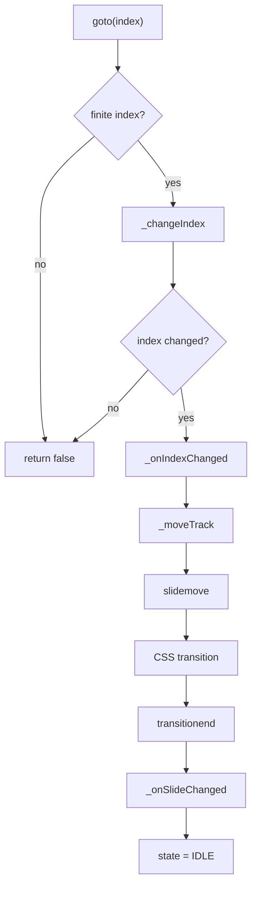

## 6.3 Core slider FSM

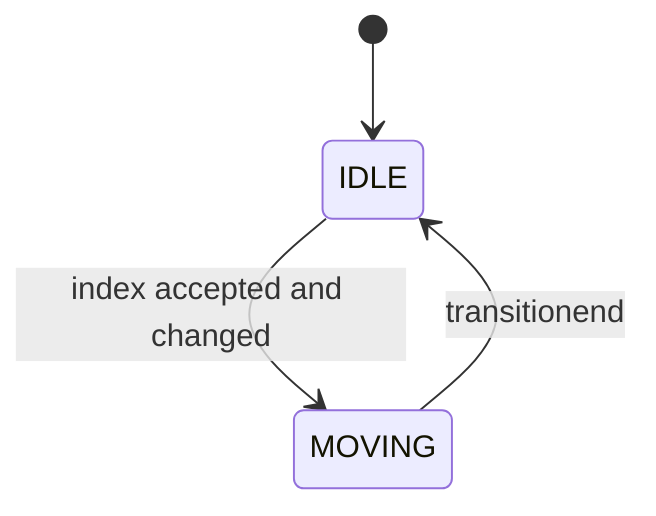

`MOVING` is a guard state: `_isInputBlocked()` returns true while the slider is moving.

## 6.4 Index model

`BaseSlider` normalizes its index using modulo arithmetic:

```js
(sourceIndex + slidesCount) % slidesCount;
```

`InfiniteSlider` overrides this logic later because its physical index includes the two clones.

## 6.5 Movement events

There is a deliberate distinction between:

```text
slidemove   = movement has started
slidechange = a new logical slide has been committed
```

`ShowcaseApp` uses this distinction to know when the slider is in a transition and when a new album should be synchronized.

---

# 7. `PaginationSlider`

Pagination is data-dependent, so the dots are generated dynamically from the slide count.

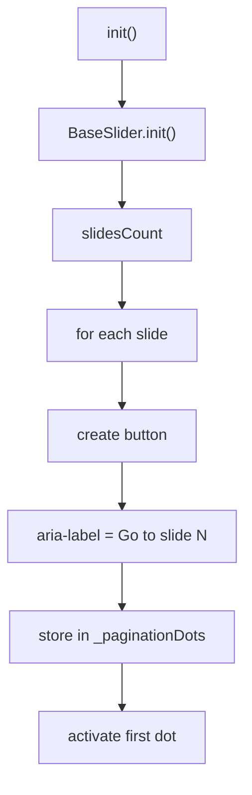

The current logical index is normalized before selecting the active dot. This becomes important for infinite looping because the physical slider index can temporarily point at a clone.

`PaginationSlider` also wraps click execution in a `Button` object that delegates matching to `ButtonManager`.

---

# 8. `KeyboardSlider`

`KeyboardSlider` adds a `KeyboardManager` and implements slider-specific command methods.

The manager is generic. The component supplies meaning.

```text
KeyboardManager
      │
      │ configuration: press.next = [...]
      ▼
_pressNext
      │
      ▼
slider.next()
```

## 8.1 Configuration contract

For an option:

```js
press: {
  next: ["ArrowRight", "KeyD"];
}
```

`KeyboardManager` derives:

```text
_pressNext
```

and verifies that it is callable before building the runtime action table.

## 8.2 Return-value protocol

A handler may return the original event, `false`, or another routing value.

This allows the enclosing application pipeline to distinguish:

```text
consume
pass through
route differently
```

The manager itself does not decide the meaning of those values; it only performs the configured dispatch.

---

# 9. `InfiniteSlider`

The infinite loop is implemented by physically cloning the boundary slides.

```text
            logical content

      [N] [1] [2] [3] ... [N] [1]
       ↑                         ↑
     clone                     clone
```

More precisely, after cloning:

```text
physical index
0         -> last clone
1         -> first real slide
2         -> second real slide
...
N         -> last real slide
N + 1     -> first clone
```

## 9.1 Teleport map

The implementation creates:

```js
{
    0: slidesCount,
    slidesCount + 1: 1
}
```

The map converts a clone position to the corresponding real position.

## 9.2 Transition handling

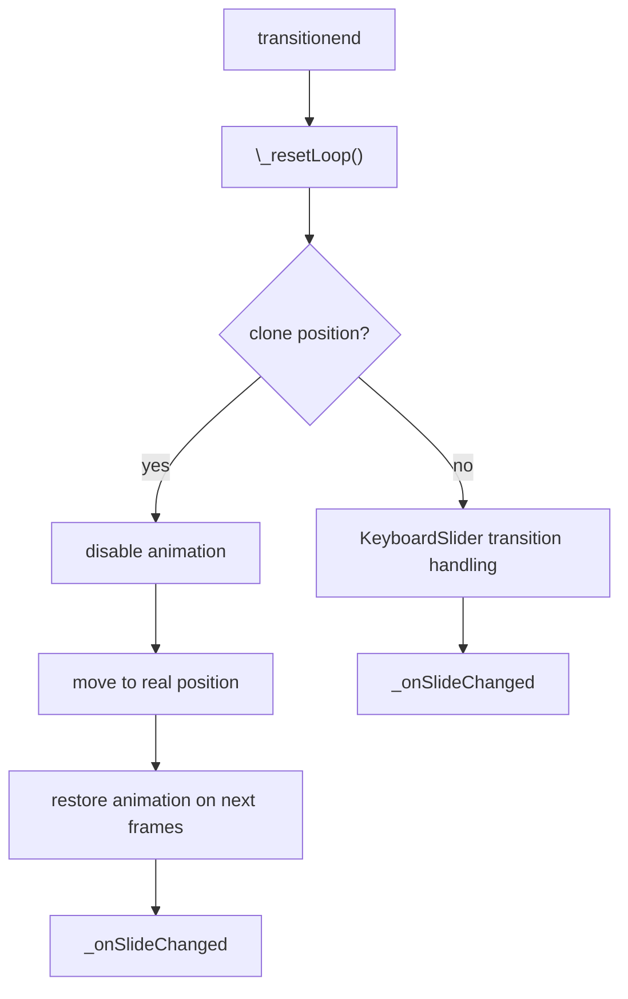

The reset is intentionally invisible to the user: the clone exists as a physical implementation detail, while `slidechange` exposes the logical slide index.

## 9.3 Polymorphic normalization

`InfiniteSlider` overrides `_normaliseIndex()` to translate between physical and logical indexing.

That is one of the clearer polymorphic points in the hierarchy: the caller keeps using `next`, `prev`, and `goto`, while the subclass changes the indexing semantics underneath them.

---

# 10. `DraggableSlider`

## 10.1 Drag lifecycle

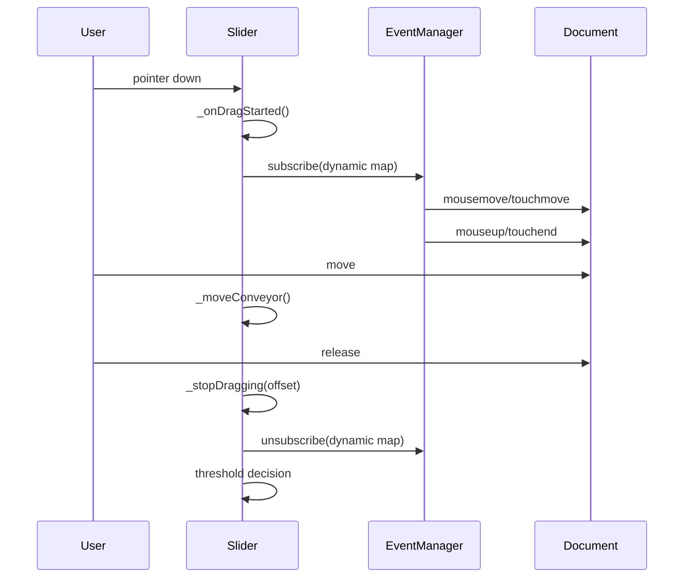

## 10.2 Threshold model

The threshold is derived from slide width:

```text
triggerThreshold = slideWidth × triggerThresholdCoef
```

The configured coefficient is accepted only within the intended range; otherwise the class default is used.

The current default in the implementation is `0.2`.

## 10.3 Decision after release

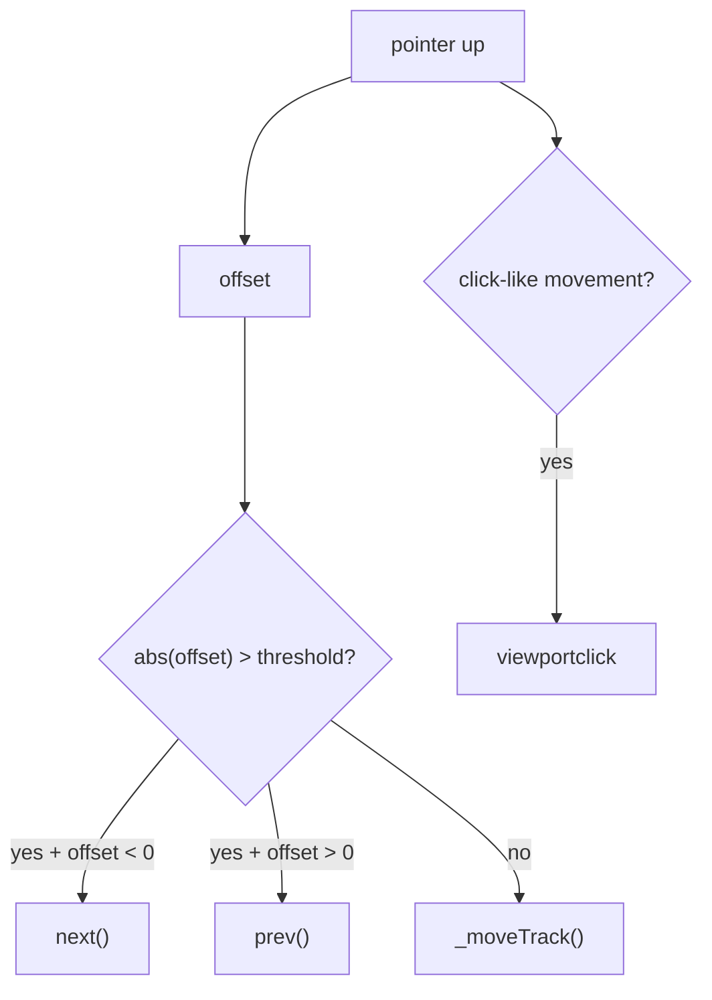

Dragging and clicking are deliberately separated. A tiny movement on a coarse pointer can be treated as a click rather than as a navigation gesture.

## 10.4 Dynamic subscriptions

The document-level movement/end events are not permanently registered. `EventManager.subscribe()` and `unsubscribe()` create a temporary interaction scope.

This is a practical lifecycle-management technique rather than a separate design pattern.

---

# 11. `AutoscrollSlider`

`AutoscrollSlider` builds a second state model on top of the core movement FSM.

## 11.1 Autoscroll FSM

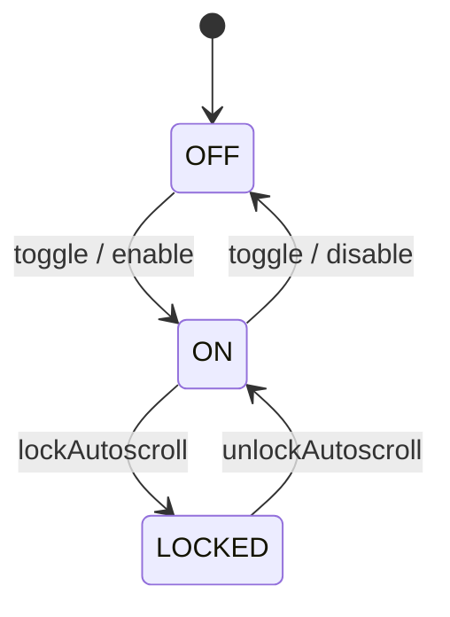

The state table is exposed as a static contract and the setter resolves it through `this.constructor.STATES_AUTOSCROLL`, preserving static polymorphism.

## 11.2 Timer model

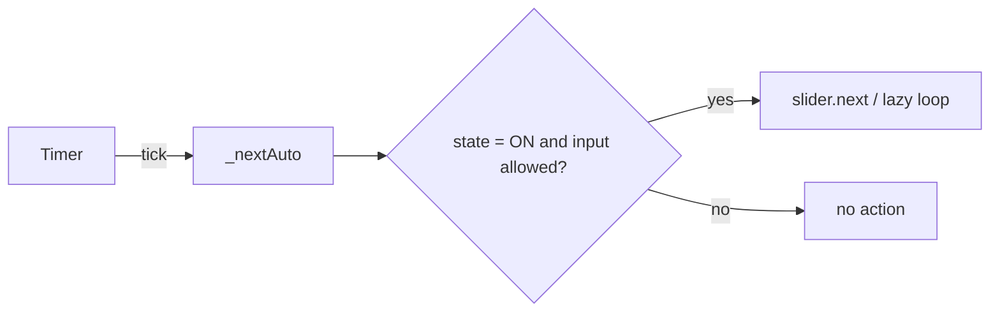

The normal autoscroll delay is `5000 ms`. The wake-up delay is `2000 ms` in the current implementation.

## 11.3 Why a separate autoscroll FSM is used

The slider can be:

```text
MOVING + ON
IDLE + ON
IDLE + LOCKED
```

These are meaningful combinations because movement state and autoplay permission describe different dimensions of behaviour.

Combining them into one large state machine would make the model harder to reason about.

## 11.4 Pause conditions

Autoscroll decisions take into account:

- whether the tab/document is active;
- mouse hover over configured pause targets;
- keyboard focus over configured pause targets;
- active dragging;
- resize lifecycle;
- explicit on/off state;
- audio playback locking;
- timing after a manual click;
- whether autoscroll is in its first cycle.

The final decision is centralized mainly in `_tryResumeAutoscroll()` and `_tryPauseAutoscroll()`.

## 11.5 Adaptive wake-up

After hover ends, the restart delay is calculated from the time already spent on the current slide.

Conceptually:

```text
elapsed on current slide
          ↓
remaining normal delay
          ↓
adaptive wake-up interval
```

This avoids restarting the five-second interval from zero after every short interaction.

## 11.6 Autoscroll action marker

`_isAutoscrollAction` distinguishes automatic movement from user-triggered movement.

This prevents the slider's own automatic transition from being interpreted as a fresh manual interaction and accidentally causing another pause/resume cycle.

---

# 12. `AudioPlayer`

`AudioPlayer` is an independent domain component built around one native `Audio` object.

## 12.1 Audio FSM

The application-level states are:

```text
IDLE
THEME
ALBUM
ALBUMTHEME
```

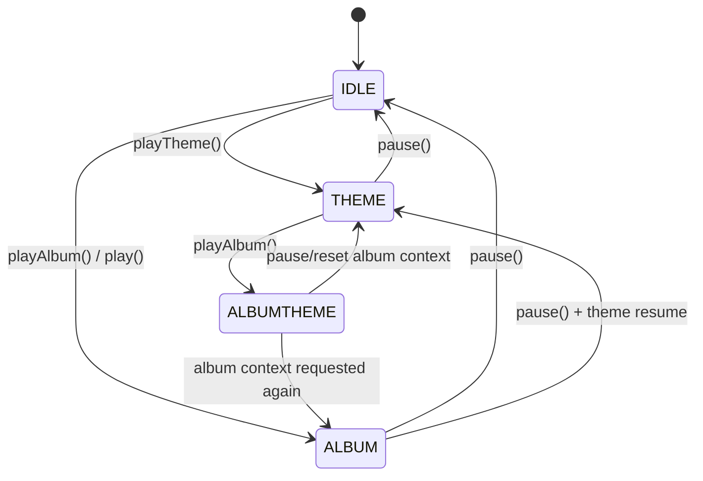

The `ALBUMTHEME` state is created by special transitions in the state setter. It captures an application-level condition that cannot be represented adequately by the native audio element alone.

## 12.2 Album and track indices

The player maintains two normalized indices:

```text
currentAlbumIndex
currentAudioTrackIndex
```

Changing album resets the track index to `0`.

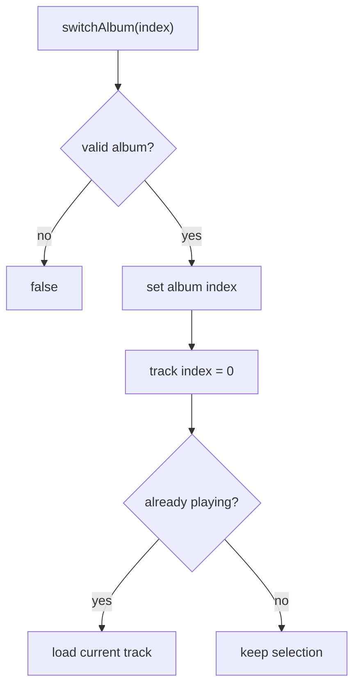

## 12.3 Main theme vs album audio

The player uses the same native `Audio` object for two contexts:

```text
                 ┌─ main theme
Audio element ───┤
                 └─ current album track
```

Application state records which context owns the element at a given moment.

## 12.4 Track progression

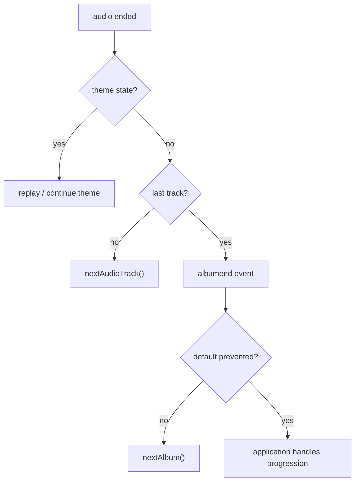

The `albumend` event is cancelable. `ShowcaseApp` uses that hook to synchronize the slider with album progression.

## 12.5 Main-theme reset threshold

When the theme has been paused, the player records a timestamp. If playback resumes after the configured threshold, the theme is rewound before continuing.

The current default is `300000 ms` (five minutes).

This is a temporal rule inside the audio domain, not an external timer service.

---

# 13. `ShowcaseApp`

`ShowcaseApp` is the application coordinator.

It deliberately does not reimplement slider, audio or shop mechanics.

Its job is to translate between components.

## 13.1 Component dependencies

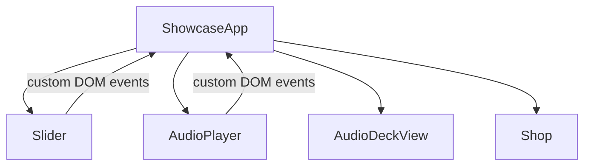

This creates a dependency direction of:

```text
components → publish events
        ↓
ShowcaseApp → coordinate consequences
        ↓
other components / view
```

The slider does not need to know that a slide corresponds to a music album. `AudioPlayer` does not need to know how the shop link is rendered.

---

# 14. Cross-component event model

`ShowcaseApp` listens for these important events:

| Event                  | Source      | Application reaction                      |
| ---------------------- | ----------- | ----------------------------------------- |
| `slidemove`            | Slider      | mark slider as moving                     |
| `slidechange`          | Slider      | synchronize shop and current album        |
| `autoscrollchange`     | Slider      | toggle theme and autoscroll UI mode       |
| `albumplay`            | AudioPlayer | lock autoscroll and activate audio UI     |
| `albumpause`           | AudioPlayer | unlock autoscroll and deactivate audio UI |
| `albumplaypassthrough` | AudioPlayer | disable autoscroll                        |
| `albumend`             | AudioPlayer | advance slider                            |
| `audiotrackchange`     | AudioPlayer | update track title and reset timeline     |
| `timechange`           | AudioPlayer | update timeline                           |
| `viewportclick`        | Slider      | toggle audio playback                     |

## 14.1 Slide change

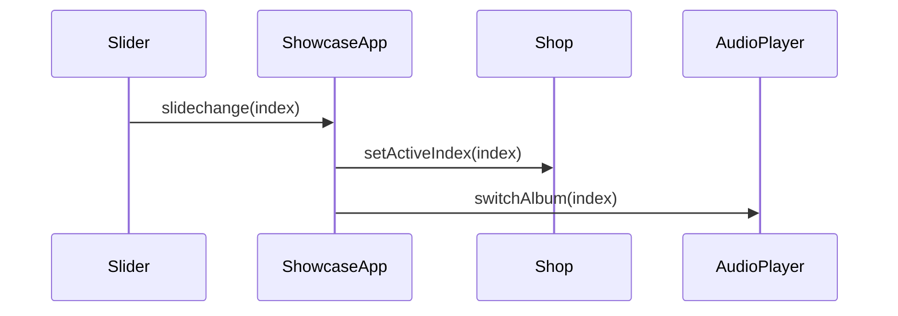

The audio switch is skipped when the document is inactive.

## 14.2 Autoscroll change

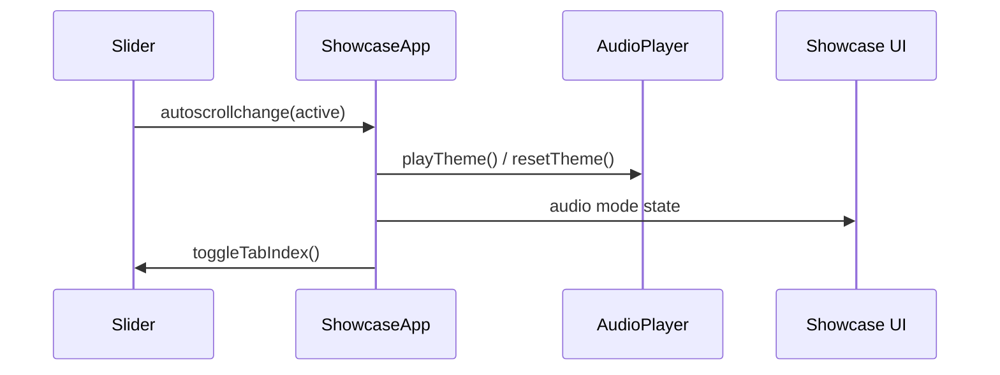

## 14.3 Album playback

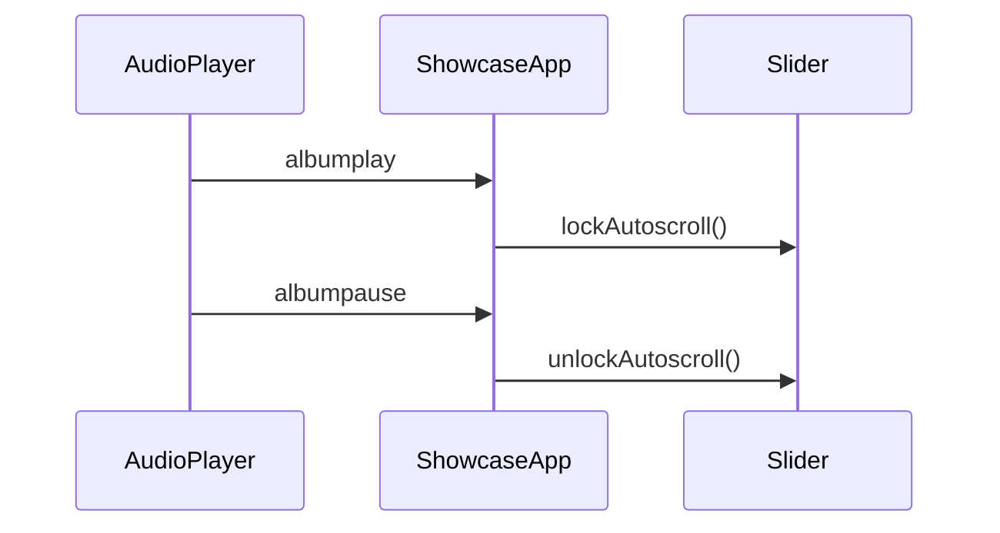

## 14.4 Album end

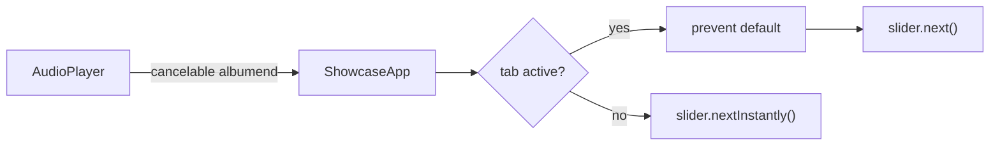

The cancelable event gives the application layer control over progression without embedding slider knowledge into the audio component.

---

# 15. EventManager

`EventManager` is the central event-subscription mechanism used inside the components and application coordinator.

## 15.1 Declarative event maps

A component defines a static event map in the form:

```text
EVENT_MAP[event] = {
    target: instance => ...,
    handler: Component.prototype.method,
    options: ...
}
```

`EventManager` resolves the actual target and registers itself as the DOM event listener.

## 15.2 Prototype-chain discovery

At initialization, the manager walks the client prototype chain:

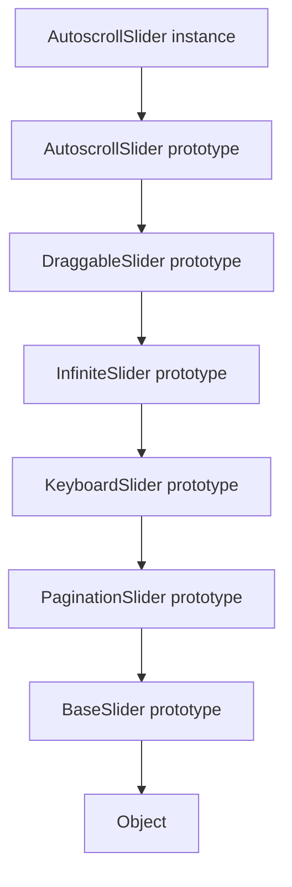

For each constructor it looks for the configured static event-map key.

This allows each inheritance level to contribute its own event declarations instead of forcing the final class to maintain one monolithic event map.

## 15.3 Event precedence

Because the manager collects maps from the most-derived prototype upward and only creates a handler when that event is not already present, a more specialized event definition takes precedence over an inherited one.

This is important for the infinite slider's `transitionend` handling: its map replaces the base transition-end handler so that clone teleportation can be handled before the base slide-commit logic.

## 15.4 Dynamic subscriptions

```text
static map     = persistent component lifecycle

dynamic map    = temporary interaction lifecycle
```

Dynamic maps are used for:

- drag movement/end events;
- the temporary `mouseleave` handler for right-click button behaviour.

This is a clean lifecycle distinction: an event needed only during an interaction should not remain globally subscribed.

## 15.5 Contract validation

The manager validates:

- event-map key type;
- target resolver;
- handler function;
- resolved target element.

Errors are surfaced as explicit contract problems instead of becoming unexplained later failures.

---

# 16. `KeyboardManager`

`KeyboardManager` converts declarative keyboard configuration into a runtime action table.

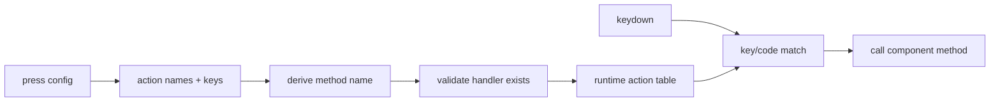

The manager supports matching against both:

```js
e.code;
e.key;
```

This permits physical-key codes and character/key values to coexist in configuration.

The important separation is:

```text
KeyboardManager = generic routing mechanism
Component       = meaning of the command
```

---

# 17. `ButtonManager` and `Button`

The click side uses the same conceptual architecture.

```mermaid
flowchart LR
    CLICK[MouseEvent] --> BUTTON[Button]
    BUTTON --> BM[ButtonManager]
    BM --> MATCH[class match]
    MATCH --> HANDLER[component command]
```

`Button` is a small adapter that detects the relevant button in an event target and invokes a command bound to a component instance.

`ButtonManager` then resolves configured button classes to component methods in the same style as `KeyboardManager` resolves key names.

The project therefore has a consistent input-routing vocabulary:

```text
input source → manager → command on component
```

---

# 18. `DOMValidator`

`DOMValidator` implements a fail-fast bootstrap rule.

The components first query their required DOM elements and then validate the resulting set.

```mermaid
flowchart TD
    INIT[component init] --> QUERY[query DOM]
    QUERY --> VALIDATE["DOMValidator.validate()"]
    VALIDATE --> FOUND{all required?}
    FOUND -->|yes| READY[continue initialization]
    FOUND -->|no| STOP[throw initialization error]
```

It handles both:

```text
individual elements
collections
```

An absent required element is therefore a configuration/DOM contract failure, not a state to be silently ignored.

---

# 19. `Timer`

`Timer` is a reusable wrapper around `setInterval`.

The most interesting feature is its bootstrap/restart behaviour:

```mermaid
flowchart TD
    START["start(delay)"] --> INTERVAL[setInterval]
    INTERVAL --> TICK[tick]
    TICK --> ACTION[onTick]
    ACTION --> BOOT{delay differs from canonical?}
    BOOT -->|yes| RESET["bootstrap(normal delay)"]
    BOOT -->|no| WAIT[next interval]
```

`AutoscrollSlider` uses this to support an adaptive temporary wake-up interval and then restore the canonical autoscroll interval.

This is infrastructure composition rather than an attempt to turn the timer itself into a state machine.

---

# 20. `AudioDeckView`

`AudioDeckView` is intentionally passive.

It owns only DOM rendering for:

- track title/number;
- timeline percentage.

```mermaid
flowchart LR
    AP[AudioPlayer] -->|audiotrackchange| APP[ShowcaseApp]
    AP -->|timechange| APP
    APP --> VIEW[AudioDeckView]
    VIEW --> DOM[track title + progress bar]
```

The view does not own playback state, album selection or the native audio element.

---

# 21. `Shop`

`Shop` is a small index-to-URL component.

```text
logical slide index
        ↓
Shop.setActiveIndex(index)
        ↓
_data[index].url
        ↓
anchor href
```

It also supports keyboard execution through `KeyboardManager` and opens the active URL in a new tab.

The component contains a read-only static `DEFAULT_URL` fallback and validates both the fallback and configured data URLs.

This is a simple data mapping component; there is no reason to describe it as a larger pattern.

---

# 22. Keyboard pipeline

Global keyboard processing is intentionally handled at the application boundary.

```mermaid
flowchart TD
    KEY[keydown] --> APP[ShowcaseApp]
    APP --> PRE[Showcase keyboard manager]
    PRE --> REPEAT{repeat / passthrough?}
    REPEAT --> MODE[routing mode]
    MODE --> NORMAL[Slider → AudioPlayer → Shop]
    MODE --> REVERSE[AudioPlayer → Slider → Shop]
    NORMAL --> RESULT[handler return value]
    REVERSE --> RESULT
    RESULT --> UI[optional pressed-button feedback]
```

## 22.1 Why the direction can reverse

When album audio is actively playing, some keys such as next/previous can belong to audio rather than slider navigation.

`ShowcaseApp` detects that situation and sends the event through:

```text
AudioPlayer → Slider → Shop
```

instead of:

```text
Slider → AudioPlayer → Shop
```

This is a routing policy in the application layer.

## 22.2 Repeat filtering

The coordinator distinguishes:

```text
normal key press
repeated key press
repeat explicitly allowed
repeat filtered
passthrough while audio is active
```

This allows one physical key to have different semantics depending on application context.

---

# 23. Pointer input and auxiliary buttons

The application also explicitly handles mouse buttons:

```text
left   → normal click / drag
middle → special forwarding rules
right  → auxiliary behaviour / temporary visual state
```

The middle/right-button cases are handled at the application boundary so the components do not need to know every browser-level input policy.

`ShowcaseApp` also uses a temporary dynamic event subscription when a right-clicked button receives a special no-active visual state.

---

# 24. Dragging + autoscroll interaction

This is one of the more important cross-cutting interactions in the slider.

```mermaid
sequenceDiagram
    participant User
    participant Auto as AutoscrollSlider
    participant Timer
    participant EM as EventManager

    User->>Auto: drag start
    Auto->>Timer: stop
    Auto->>EM: subscribe dynamic drag map
    User->>Auto: drag / move
    Auto->>Auto: update conveyor
    User->>Auto: release
    Auto->>EM: unsubscribe dynamic drag map
    Auto->>Timer: resume if conditions permit
```

The drag subclass owns the mechanics; the autoscroll subclass adds pause/resume semantics by overriding the drag-start/end hooks and calling the parent implementation.

This is a good example of inheritance preserving a lifecycle contract while specializing only the additional behaviour.

---

# 25. Resize lifecycle

Resize is treated as a temporary mode rather than as an ordinary slide transition.

```mermaid
flowchart TD
    R[resize] --> BEFORE[_beforeResize]
    BEFORE --> FLAG[isResizing = true]
    FLAG --> PAUSE[pause autoscroll]
    PAUSE --> INSTANT[update track instantly]
    INSTANT --> WAIT[short timeout]
    WAIT --> AFTER[_afterResize]
    AFTER --> SIZE[recalculate slide width]
    SIZE --> POS[restore track position]
    POS --> IDLE[state = IDLE]
    IDLE --> RESUME[try resume autoscroll]
```

`BaseSlider` handles the geometry and resizing lifecycle; `AutoscrollSlider` extends the hooks to integrate autoplay behaviour.

This is another example of the inheritance hierarchy acting as a controlled set of lifecycle extension points.

---

# 26. Accessibility-related behaviour

Accessibility is not a separate subsystem, but several architectural decisions support it directly.

Pagination buttons receive:

```text
aria-label="Go to slide N"
aria-current="true"
```

Focus is also managed when application modes switch:

```text
autoscroll active ↔ manual controls
manual audio active ↔ slider controls
```

The application changes `tabIndex` on mutually exclusive control groups and clears focus when the interaction context changes.

This keeps the keyboard interaction model consistent with the visual mode of the showcase.

---

# 27. Configuration as a runtime contract

Configuration is not merely a bag of constants.

Several managers derive implementation details from configuration and then validate the result.

Examples:

```text
press.next
   ↓
_pressNext
```

```text
click.goto
   ↓
_clickGoto
```

```text
EVENT_MAP
   ↓
target resolver + handler reference
```

This creates a lightweight declarative layer over the component methods.

The benefit is that reusable manager code can remain generic while individual components retain domain-specific behaviour.

---

# 28. Static contracts and polymorphism

The implementation uses a mixture of module constants and static class properties.

The important distinction is intent.

## Fixed implementation detail

A value that belongs only to one implementation can stay private to the module.

## Class-level contract

A value that describes a class-level capability/configuration can be exposed as a static property.

## Polymorphic class-level contract

When inherited code should respect the runtime constructor, the implementation uses:

```js
this.constructor.SOMETHING;
```

For example, the state setters resolve their state table from the actual constructor rather than pinning it permanently to the base implementation.

This is not used mechanically. Direct concrete-class references remain preferable where polymorphism is not intended.

---

# 29. Encapsulation strategy

The components keep implementation details behind their own fields and methods.

Examples:

```text
_slider
_track
_currentIndex
_activeIndex
_isDragging
_timer
_keyboardManager
_eventManager
_player
_currentAlbumIndex
_currentAudioTrackIndex
```

External coordination operates through public methods and custom events rather than directly modifying those internals.

This creates a practical boundary:

```text
public API
   ↓
component invariant
   ↓
private/internal mechanics
```

---

# 30. Normalized index as a domain invariant

The slider and audio player both normalize indices before storing them.

For the audio player:

```js
(index + totalCount) % totalCount;
```

For the infinite slider, normalization is overridden because the physical index includes cloned elements.

The general architectural rule is:

> Keep invalid/out-of-range index values from propagating into the rest of the component.

The normalization therefore belongs in the component's own setters/helpers rather than being repeated at every call site.

---

# 31. Error handling and validation

The code validates several categories of contract:

```text
DOM structure
configuration sections
configured handler methods
event-map target/handler functions
URLs
playlist presence
state transition tokens
```

The overall philosophy is mixed deliberately:

```text
invalid bootstrap contract → throw
invalid runtime command/index → reject or return false
optional/pass-through event → return event
```

This avoids both extremes of throwing for every user input and silently accepting broken component configuration.

---

# 32. Patterns and principles actually present

## Prototype inheritance / polymorphism

This is the core structural technique of the slider hierarchy.

## Command dispatch

Keyboard and click managers transform configuration into executable component commands.

## Observer-like event publication

Components publish custom DOM events and the application reacts to them. This resembles Observer behaviour, but the implementation is grounded in the browser's own event system rather than a custom observer library.

## Coordinator / application-layer orchestration

`ShowcaseApp` is best described as an application coordinator. It owns cross-component policy without absorbing the internal implementation of those components.

## Template-method-like inheritance hooks

Methods such as `_onIndexChanged`, `_onIndexChangedInstantly`, `_onDragStarted`, `_onDragEnded`, `_beforeResize`, and `_afterResize` form extension points. Child prototypes add behaviour around the parent's lifecycle.

This is a useful description of the mechanism; the project does not need to claim that every inheritance method is a formal Gang-of-Four Template Method implementation.

## Fail-fast validation

`DOMValidator`, manager contract checks and data validation establish explicit runtime boundaries.

## Single-responsibility principle

The components are separated by domain responsibility and the managers by infrastructure responsibility. This is a principle of the design rather than a claim that every object is a textbook SRP example.

---

# 33. Why there is no separate generic State-pattern object

The project uses FSMs, but the FSMs remain inside the components that own the relevant behaviour.

```text
BaseSlider        → movement state
AutoscrollSlider  → autoplay state
AudioPlayer       → audio context state
```

The states affect local invariants and transitions directly, so introducing an additional family of state objects would add another abstraction layer without removing a current responsibility.

The architecture therefore uses **explicit local FSMs** rather than a separate reusable State-pattern framework.

---

# 34. Why `ShowcaseApp` is not a domain "god object"

`ShowcaseApp` does know about all major components, but it does not implement their internal behaviour.

For example:

```text
ShowcaseApp
    ├── tells Slider to lock/unlock autoscroll
    ├── tells AudioPlayer to switch album
    ├── tells Shop to switch URL
    └── tells AudioDeckView to render
```

It does not:

```text
    ├── calculate drag offsets
    ├── manipulate Audio.currentTime directly
    ├── calculate infinite-loop teleport indices
    └── build pagination controls
```

That distinction keeps orchestration separate from domain mechanics.

---

# 35. End-to-end example: ArrowRight

```mermaid
sequenceDiagram
    participant K as Browser
    participant APP as ShowcaseApp
    participant KM as KeyboardManager
    participant SL as Slider
    participant AP as AudioPlayer
    participant SH as Shop

    K->>APP: keydown ArrowRight
    APP->>KM: manage(event)
    KM-->>APP: routing mode
    APP->>SL: handleKeyDown(event)
    SL->>SL: _pressNext()
    SL->>SL: next() → goto()
    SL->>SL: state = MOVING
    SL-->>APP: handled
    Note over SL: CSS transition runs
    SL->>APP: slidechange(index)
    APP->>SH: setActiveIndex(index)
    APP->>AP: switchAlbum(index)
```

If album audio is already active, the pipeline can reverse and give the same ArrowRight event to `AudioPlayer` first.

---

# 36. End-to-end example: user drag

```mermaid
sequenceDiagram
    participant U as User
    participant S as AutoscrollSlider
    participant T as Timer
    participant E as EventManager

    U->>S: touchstart / mousedown
    S->>T: stop
    S->>S: _isDragging = true
    S->>E: subscribe dynamic map
    U->>S: move
    S->>S: _moveConveyor(x)
    U->>S: release
    S->>S: compare offset with threshold
    alt threshold crossed
        S->>S: next() / prev()
    else threshold not crossed
        S->>S: restore current position
    end
    S->>E: unsubscribe dynamic map
    S->>T: resume if conditions permit
```

---

# 37. End-to-end example: album playback

```mermaid
sequenceDiagram
    participant U as User
    participant APP as ShowcaseApp
    participant AP as AudioPlayer
    participant S as Slider
    participant V as AudioDeckView

    U->>APP: click / keyboard play
    APP->>AP: handle input
    AP->>AP: playAlbum()
    AP->>AP: state = ALBUM
    AP->>APP: albumplay
    APP->>S: lockAutoscroll()
    APP->>APP: activate audio UI

    AP->>APP: audiotrackchange
    APP->>V: render title + reset timeline

    AP->>APP: timechange
    APP->>V: render timeline

    AP->>APP: albumend
    APP->>S: next() / nextInstantly()
```

---

# 38. Application data model

The configured album data has two related datasets:

```text
AudioPlayer playlist
    └── audio source paths

ShowcaseApp albums
    └── artist / title / year / track names

Shop data
    └── purchase URLs
```

The shared logical index is the key synchronization value.

```mermaid
flowchart LR
    I[album index] --> A[album artwork / slide]
    I --> P[audio playlist]
    I --> N[track names]
    I --> U[purchase URL]
```

This is deliberately simple: the application does not introduce a separate store/state container just to hold the album index.

---

# 39. Browser/platform integration

The implementation includes a small platform-awareness layer in `helpers.js` and the components:

- `matchMedia("(pointer: fine)")` is used to distinguish fine-pointer interactions;
- `document.hidden` controls visibility-aware autoplay behaviour;
- touch multi-contact is rejected for dragging;
- platform modifiers are checked for keyboard routing;
- Shift is used as the override/passthrough modifier in the application's interaction protocol;
- the Audio API's `MediaSession` integration is initialized when available;
- DOM events remain the primary browser integration surface.

These helpers centralize repeated browser capability checks instead of scattering raw feature tests through every component.

---

# 40. Directory responsibilities

```text
script/
├── components/
│   ├── base-slider.js
│   ├── pagination-slider.js
│   ├── keyboard-slider.js
│   ├── infinite-slider.js
│   ├── draggable-slider.js
│   ├── autoscroll-slider.js
│   ├── audio-player.js
│   ├── audio-deck-view.js
│   └── shop.js
│
├── core/
│   └── button.js
│
├── services/
│   ├── event-manager.js
│   ├── keyboard-manager.js
│   ├── button-manager.js
│   ├── dom-validator.js
│   └── timer.js
│
├── utils/
│   └── helpers.js
│
├── main.js
└── showcase-app.js
```

The directory layout reflects the same conceptual split:

```text
components  → domain behaviour
services    → reusable mechanisms
core        → small command/input primitives
utils       → stateless browser/general helpers
composition → main.js + ShowcaseApp
```

---

# 41. Architectural invariants

The most important invariants to preserve when extending the project are:

1. **A component owns its own state.**
2. **Cross-component consequences travel through application coordination/events.**
3. **A manager should remain generic; domain meaning stays in the client component.**
4. **A subclass should extend a lifecycle contract, not duplicate its parent's implementation.**
5. **Physical slider indices and logical indices must remain separate in the infinite implementation.**
6. **Temporary pointer events should be unsubscribed when the interaction ends.**
7. **Autoscroll permission and slider movement state remain separate concerns.**
8. **Invalid configuration/DOM contracts should fail early.**
9. **Input handlers should communicate whether the event was consumed or should continue through the pipeline.**

---

# 42. Architectural summary

```mermaid
flowchart TB
    USER[User input]
    USER --> APP[ShowcaseApp]

    APP -->|commands / pipeline| COMPONENTS
    APP -->|custom event reactions| COMPONENTS

    subgraph COMPONENTS[Domain components]
        SL[Slider hierarchy]
        AU[AudioPlayer]
        V[AudioDeckView]
        SH[Shop]
    end

    subgraph SERVICES[Infrastructure]
        E[EventManager]
        K[KeyboardManager]
        B[ButtonManager]
        D[DOMValidator]
        T[Timer]
    end

    SL --> SERVICES
    AU --> SERVICES
    SH --> D
    APP --> E
    APP --> K
    SL -->|slidechange| APP
    AU -->|audio events| APP
```

The resulting architecture can be summarized as:

```text
prototype hierarchy
        +
local FSMs
        +
configuration-driven command routing
        +
declarative/dynamic event management
        +
independent domain components
        +
application-level coordination
        =
structured interactive showcase architecture
```

The design is intentionally educational, but the architectural techniques themselves are directly applicable to larger JavaScript applications: encapsulated components, explicit contracts, controlled lifecycles, state separation, polymorphism, event-driven coordination and reusable infrastructure.
